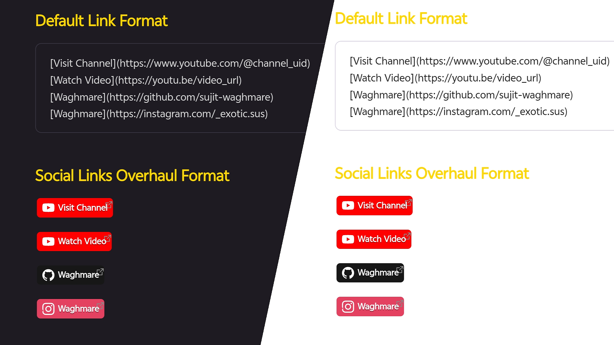

# Social Links Overhaul

> **Tired of boring blue underlined links?** Your notes deserve better.

Turn this → `[Waghmare](https://github.com/sujit-waghmare)`

Into this → a branded badge with logo, color, and style. Automatically. No plugins. No JavaScript. Pure CSS.



---

## Why This Exists

Every time you paste a YouTube or GitHub link into Obsidian, you get the same dull hyperlink. Blue text. Underline. Nothing tells you *what* it is at a glance.

This snippet fixes that. It detects the URL and renders a styled badge — YouTube gets red, GitHub gets dark, Instagram gets pink — each with the platform's logo injected via SVG mask. No external requests. No setup beyond pasting one file.

---

## Supported Platforms

| Platform | Badge Color | Trigger |
|---|---|---|
| YouTube | `#FF0000` Red | `youtube.com`, `youtu.be` |
| GitHub | `#181717` Dark | `github.com` |
| Instagram | `#E4405F` Pink | `instagram.com` |

---

## Installation

> You only need **1 file**. No plugins, no terminal.

**Step 1** — Navigate to your vault's snippets folder:

```
YourVault/
  └── .obsidian/
      └── snippets/
```

> If `snippets/` doesn't exist, enable "Show hidden files" in your file manager.

**Step 2** — Create a file named exactly:

```
social-link-overhaul.css
```

**Step 3** — Paste the full CSS from [The CSS Code](https://github.com/sujit-waghmare/social-link-overhaul/blob/0541ced504ddff2d86e70e8f7e31116b50bf47bd/Social%20Links%20Overhaul.css) section and save.

**Step 4** — In Obsidian: `Settings → Appearance → CSS Snippets`

**Step 5** — Toggle **social-link-overhaul** ON.

> [!warning] After updating the CSS file, toggle the snippet OFF → ON (or click the refresh icon) to reload changes.

---

## How to Use

Just paste any standard link. No special syntax.

```markdown
[Visit Channel](https://www.youtube.com/@channel_uid)
[Watch Video](https://youtu.be/video_url)
[Waghmare](https://github.com/sujit-waghmare)
[Waghmare](https://instagram.com/_exotic.sus)
```

Badges render automatically in both **Live Preview** and **Reading** mode.

---

## The CSS Code

Copy and paste the full block from `social-link-overhaul.css` in this repo.

---

## Customization

| Value | What it changes | Location in CSS |
|---|---|---|
| `#FF0000` | YouTube badge color | `background-color` under `a[href*="youtube.com"]` |
| `#181717` | GitHub badge color | `background-color` under `a[href*="github.com"]` |
| `#E4405F` | Instagram badge color | `background-color` under `a[href*="instagram.com"]` |
| `#FFFFFF` | Text + logo color | `color` and `::before background-color` |
| `11px` | Badge text size | `font-size` |
| `4px` | Corner roundness | `border-radius` (try `12px` for pill shape) |

---

## Changelog

### v1.3.0
- Added Instagram support with branded pink badge and SVG logo

### v1.2.0
- Added GitHub support with dark badge and Octocat logo

### v1.1.0
- Initial release with YouTube support (youtube.com + youtu.be)

---

## Roadmap / Future Ideas

- [ ] Twitter/X support
- [ ] LinkedIn support
- [ ] Spotify support
- [ ] Reddit support
- [ ] Custom user-defined domains via CSS variables
- [ ] Configurable badge size (small / default / large)
- [ ] Optional outline/ghost badge style variant

---

## Troubleshooting

**Links aren't turning into badges**
1. Check file is named `.css`, not `.css.txt`
2. Confirm snippet is toggled ON in `Settings → Appearance`
3. Verify the URL contains `youtube.com`, `youtu.be`, `github.com`, or `instagram.com` — shortened/redirect URLs won't trigger the CSS

**Logo is missing**
The SVG uses a base64 mask string. If even one character was accidentally deleted, the logo breaks. Re-copy the CSS block from this repo.

**Looks broken with my theme**
Heavy themes may override link styles. The `!important` tags usually force through, but if not — place this snippet at the bottom of your snippets folder (Obsidian loads alphabetically) or disable theme-level link styling.

---

## FAQ

**Does this pull from Shields.io?**
No. 100% pure CSS. No external network requests.

**Does it read the channel/repo name automatically?**
No. CSS cannot parse URLs. The badge text is exactly what you typed as link text.

**Does it work on mobile?**
Yes. Sync your `.obsidian/snippets/` folder and it renders identically on iOS and Android.

**Can I add Twitter/X?**
Yes — copy a CSS block, replace `youtube.com` with `twitter.com`, set background to `#000000`, and swap the base64 SVG for a Twitter logo from [Simple Icons](https://simpleicons.org/).

---

## Issues & Contact

Found a bug? Badge not rendering? Platform you want added?

→ [Open an issue](https://github.com/sujit-waghmare/social-link-overhaul/issues)

**Want a platform added?** Just ask in the issues — if it has a public SVG logo, I can add it. Twitter, LinkedIn, Spotify, Reddit, Discord, or anything else you use.

For bugs, please include:
- Obsidian version
- Theme name (or "default")
- Screenshot of the broken render
- The link format you used

---

## License

**MIT License (Non-Commercial)**

Copyright (c) 2025 Waghmare

Free to use, share, and modify. **Cannot be sold or used commercially.**
Must credit Waghmare with a link to this repo.

→ [Full License Text](LICENSE) · [MIT](https://opensource.org/licenses/MIT)

---

## ❤️ Support

If you find this plugin helpful, please consider **starring** the project on [GitHub](https://github.com/sujit-waghmare/social-link-overhaul) to show your support! 

If you'd like to go the extra mile, you can show some love through a donation—it helps keep the coffee flowing and the code growing.

<a href="https://buymeacoffee.com/sujit.waghmare">
  
</a>

---

<p align="center">Made by <a href="https://github.com/sujit-waghmare">Waghmare</a></p>
